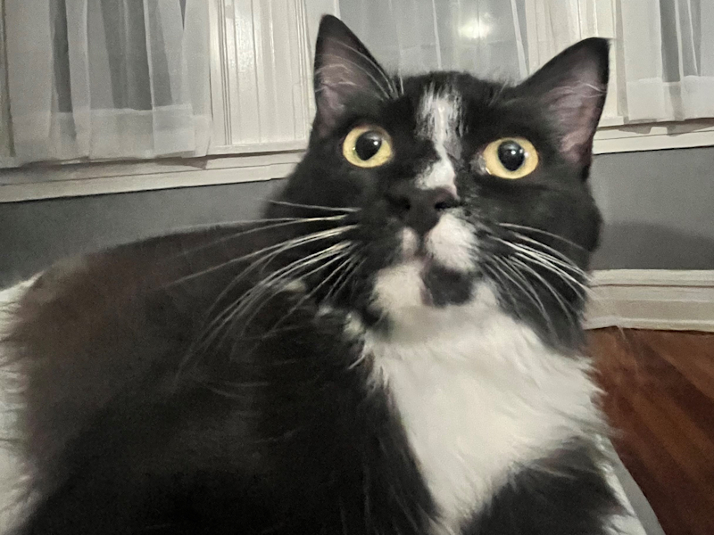

# zgatto

## About

zgatto = zelda (my cat) + gatto (italian --> 'cat')

## How to Use
Quite simple: 
  1. Download both files in ```/zgatto/``` to your website's file system. Make sure they remain in the same ```/zgatto/``` directory.
  2. Add the following to your html: ```<script src="/path/to/zgatto/zgatto.js"></script>```
  
& that should be it! zgatto was designed with simple integration in mind. 

## Cat Tax

